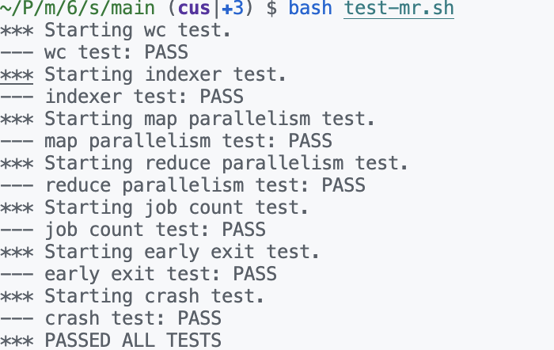

## Time Spent

4 + 6 = 9h

### Why?

#### First Day

1. spend 1.5h to design
2. spend 2.5 to write little (sleep while write): RPCstruct, some handle (but all be changed next day)

#### Second Day

1. spend 3h to finish: change yesterday all
2. spend 3h to debug: write a lot printf(1h)

## Bug and Trouble

1. a, b := range m that b is a copy(1h) too long do not use go(stupid)
2. os. Rename can not cross file system(1h) because it use syscall_link so just put tmp on pwd
3. JSON encode clean file(0.5h)just keep the fd and release them when job finish
4. repeat key in out(0.2h)forget to copy sort
5. test error(0.1h)remember to clean .so file in mrapp

## Design

### Coordinator

~~~go
type Coordinator struct {
	sync.RWMutex
	nReduce      int
	nMap         int
	mapTask      []string //taskid filename
	mapStatus    []mrTask
	reduceStatus []mrTask
	mapDone      bool
	reduceDone   bool
}
~~~

1. check and update mapDone and reduceDone on TaskComplete handle robustly
2. a big lock to keep safe for multiple coordinator(requirement from lab, but why?question after read the crawler.go on lec2)
3. use mrTask as stat design

### RPC

~~~mermaid
sequenceDiagram

Worker->>+Coodinator: fetch nMap nReduce

Coodinator-->>-Worker: value

Loop mapid != -2 (!MapDone)

Worker->>+Coodinator: fetch Map Task

Coodinator-->>-Worker: mapid filename

Worker->>Coodinator: send CompleteMap

end

Loop mapid != -2 (!MapDone)

Worker->>+Coodinator: fetch Reduce Task

Coodinator-->>-Worker: reduceid

Worker->>+Coodinator: send CompleteReduce

end
~~~

I am too lazy so use just one args and reply, maybe one day will back to fix it.(fixed)

### Worker

1. map nothing important but a loop, handle all fd
2. reduce read all mr-x-specReduceID and pass open fail

## PASS

