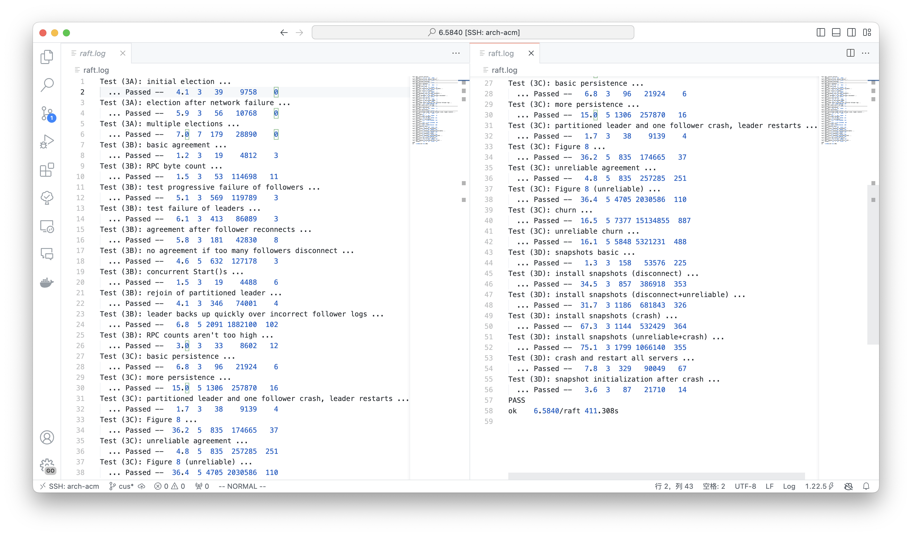

# A-basic

## Time Spend

1 week(4-6h per day) + 3h

why? wasting time on trying to use channel to synchronize the resource between each state gorountine and RPC handle, finally give up and quickly finish it via using mutex within 3 hours, sadly !-_-.

## Why Channel is so Difficult

In my final design, 3 member(scheduler, state handler, RPC receiver) have a large problem on synchronize their state:

1. scheduler lead the state transmission, but the transmission signal may send by state handler. This situation may cause parent and children block other so was given up.
2. state handler deal with all things happened in its lifecycle, such as get the RPC args, handle RPC reply, handle state transmission, and so on. A large number of signal channel must hold, and may no be faster then mutex checker.
3. the protection of critical area in raft object is ineluctable, due to the RPC receiver. we can just send a signal to the current state gorountine then wait for reply, and difficult to let state gorountine not to be blocked in each select case.
4. The finished time of state handlers is a also a problem.

Maybe we can use mutex on RPC receiver and channel on state routine, but its complexity is so large then you must pay attention on understanding the constrains of raft peer, when the speed of critical area is not a hot spot in this lab.

So, just use the mutex. Switching to mutex is absolutely simpler than persisting channel.

## Design

3 function, which are follower(no behavior), leader, and candidate, need lock to enter, and release the lock when finish initialize. If they need get lock again, check their previous saved term is as same as the current, and current state also.

Each RPC handle also follow the above rule. For example, heartbeat producer first lock and check leader restrain, if it satisfy, go heartbeat handle, else unlock and return. heartbeat handle hold the lock to initialize, then unlock to send RPC, when reply, get lock and check leader restrain again before deal with.

Ticker check election time out by time.now - lastHeartbeatTime, and go candidate to switch when satisfy.

Leader use heartbeat to activate itself.

# BC-Log & Persist

## Time Spend

4h x 4, totally 16h.

## Design

Use 2 conditional to synchronize Start(), AppendRPC, CommitRegenerator, Applier. But commit regenerator just a for loop.

Applier use a buffer to reduce frequency of detecting commit > applied. Sending do not need to lock.

Other than that, no thing need to mention, just remember to refuse the commit index update on in current term.

## Speed of Backing Up Test

The hot spot is, you need to send heartbeat to all peer immediately after you updating the commit index.

# D-Snapshot

## Time Spend

2x6h

## Difficulty

1. the behavior of snapshot.
2. index (toLogIndex and toAbsIndex)

## Design

```go
type InstallSnapshotArgs struct {
	Term              int
	LeaderId          int
	LastIncludedIndex int
	LastIncludedTerm  int
	Data              []byte
}

type InstallSnapshotReply struct {
	Term  int
}
```

add CurrentSnap and `lastInlucedIndex` on raft.

InstallRPC need to keep the **lock** when applying snapshot to avoid unreliable network problem, but applier needless due to service refuse previous applied index. It is not a hot spot.

Keep index on the persister and use it to update committedIndex and lastApplied when starting from crash.

## Problem

Slow recovery after crash, but the speed may be enough.

# PASS


