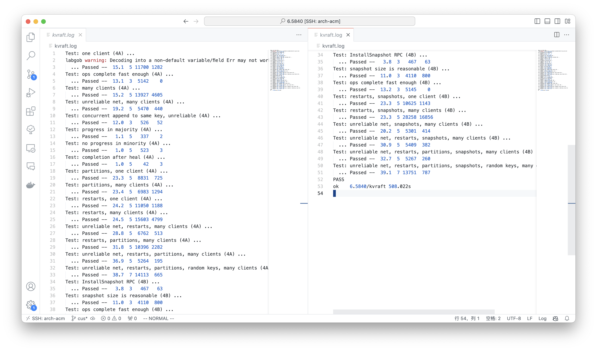

## Time

\>=18h, maybe.

more than 12h on A but 6 hours on B.

## Design

### Clerk

1. repeatedly send RPC, but change leader ID when timeout or meet ErrWrongLeader, and sleep ELECTION_TIMEOUT when send a round of server and SMALL_INTERVEL when send to the same server.
2. Identify each operation by (Clerk ID, Write Index) named info

### Server

1. Each operation submit info on the map\[index\]info, then wait on condition until index was applied or info changed, only when index <= current and windex <= current can return OK.(Only Usage of info is to announce all waiting RPC when meet unmatched info on applying)
2. Apply handler, only receive the next index, will update the info and windex
3. NONE command commit will be perform when too long time to not meet applied command, aim to update the RPC waiting but commit error.
4. Some delicate check.

### Snapshot

1. Loop Checker.
2. Read Snapshot when kv was made.
3. Remember to initialize the state when read, and broadcast when install.
4. The appliedIndex between server and raft is different, so refuse the less index snapshot and pay more attention on InstallSnapshot and Apply, apply update appliedIndex only after finish channel send and current appliedIndex less than send index.

## Problem

1. Large count of RPC.
2. Poor speed performance on Snapshot. (Maybe back to find hot spot)
3. Raft install snapshot should only send snapshot when applied index less than lastIncludedIndex
4. Need to repeatedly test due to the unpredicted problem(data race, dead lock, and so on)

## PASS

