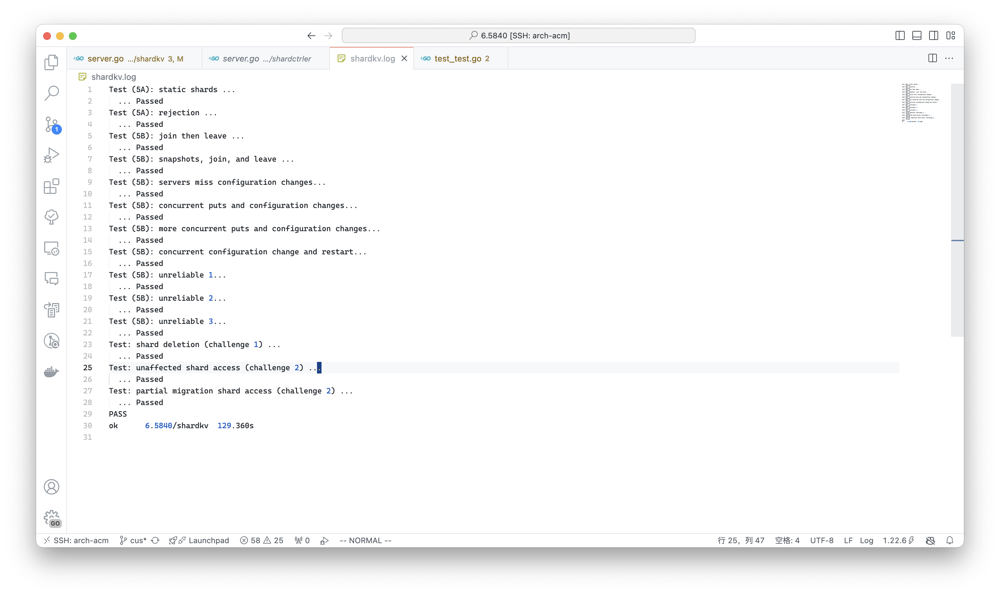

## Time Spend

2.5 weeks but actually 20h - 28h.

## Design

### Controller

The key logic of ctrler is reconfiguration. Use x present n / g and a is n % g.

- iter from sc.Shards, to get the scount of gid.
- If a != 0, the scount of gid is can be x + 1, else x. If meet gid with larger scount, set gid of shards to 0
- Ordered iter from the Groups. If scount of gid no reach the target(a -> x + 1, else x), pop 0 shards to satisfy.

Other function can be simple to implement.

### ShardVersion

Use shardcnum slice to store the version of shards at the current group, only shardcnum == currentconfig that the shard is valid.

Need to change rpccommit to check shard is valid or not. If not valid, return WrongGroup only when server is leader.

### ShardMovement

Use shardtarget to hold the endpoint of target.

A sender will be awake to send the shard in shardtarget per SEND_DURATION. If send success, the commandSendSuccess will be commit, to delete the shard information.

When a send rpc reach target, it will be rejected if it is finished(ccnum >= rcnum) or currernt config below (currentcnum <= ccnum), then commit op, only ccnum >= rcnum will return with OK(no Err).

The Op will check whether it is finished again, and receive the data of shard, then update the cnum of shard. (has shard -> current, else -> current - 1 and add to shardtarget)

This means that the shard movement cannot be canceled.

### ConfigUpdate

A single thread to query, if config changed, commit the relative command to raft.

When process command, the cnum == nxtcn - 1 shard will update cnum to nxtcn.

Else the shard will be add to shardtarget(if not be added before).

## Problem

Think too more. Some guesses are not actual. Such as skip the config, leave server offline(can not be sent shard) and so on. (May the test is not strict)

## NoCreditChallenge

All achieve, the design seem above. We choose not poll but just receive shard from peers.

## PASS

