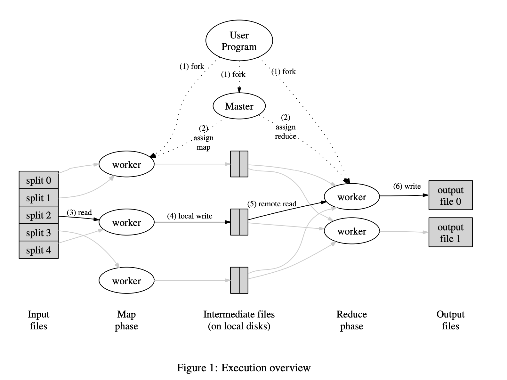

3 members: master, map worker, reduce worker

## Map

(k_i, v_i) -> list(k_1, v_1)

such as (filename, filectx) -> list(word, 1)

MUST all map worker has done that reduce procession start but reduce start when master be announced by map complement

## Reduce

list(k, list(v)) -> list(k, v_o)

such as (w_s, list(1, 1, 1, ...)) -> list(w_s, count)

can be seem to perform operation on key, but remember that each (key, list) is a part of actual k list pair, so the input key will be same.

Reduce to perform the sort method to make a typical input

when output, Reduce just extend the output

## Master

store M_state(idle, processing, completed), machine identify(non-idle).

machine identify(location, R file size)

## Failure

1. use ping periodically to confirm machine alive
2. when map task completed but fail, then re-execute
3. when a map be re-execute by different machine, all processing reduce worker re-execute

## BackupTask

use when close to completion to reduce the low perform machine wasting time by setting a backup task to other machine then accept one complete firstly due to the lower performance machine just few of all.

## Extension

### Partitioning Function

Use $hash(Url) mod R$ instead of $hash(M) mod R$ to assign Map result to Reduce task, which make the specified R worker don't need to redo the connection

This use with the CSF together to let R worker run machine as same as W machine

### Ordering Guarantees

process by increasing key order, which is useful when the output file format needs to support efficient random access lookups by key, or users of the output find it convenient to have the data sorted

### Combiner Function

Use to partially merge data then reduce can be easier because of the slow network
