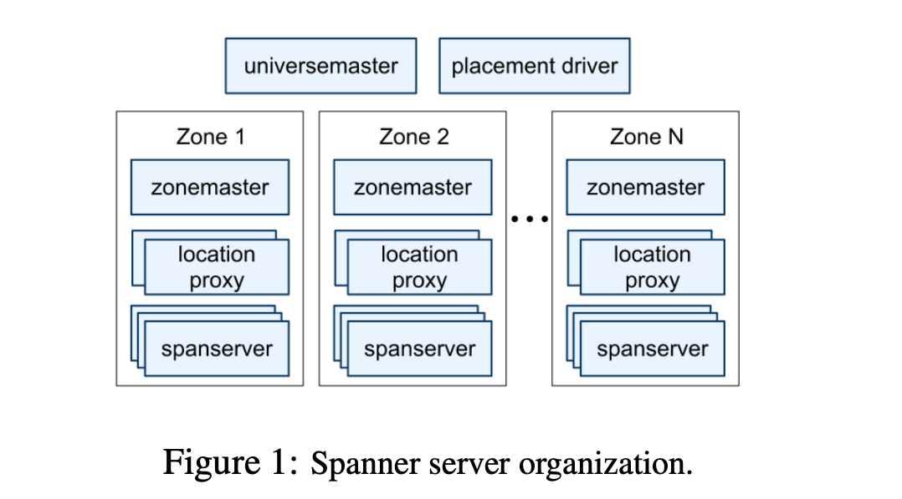
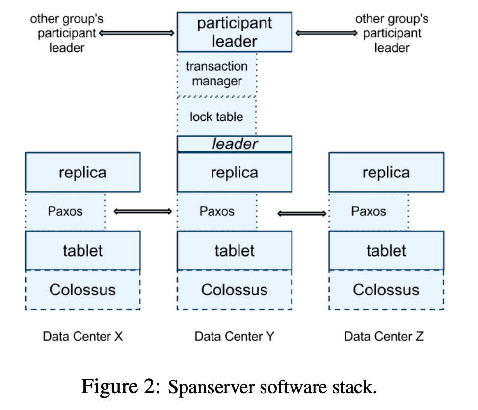
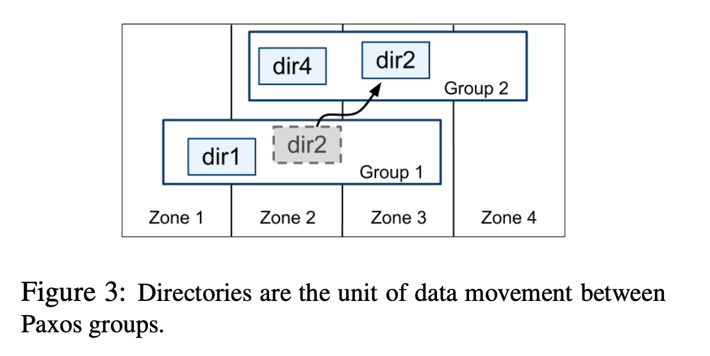
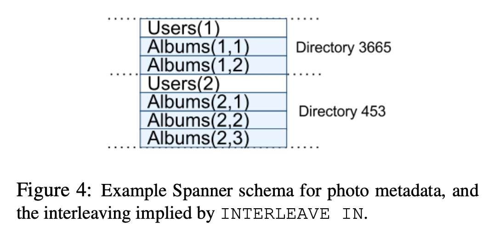

# Introduction

Database: scalable, multi-version, globally-distributed, synchronously-replicated.

Support externally-consistent distributed transaction

## Usage

Share Data across many sets of Paxos.

Hundreds datacenter(paxos), Trillion rows.

auto migrate data

## Need

lower latency --over--> higher availability: One geographic region, 1 or 2 datacenter failures.

Bigtable-like hard to use.

So use temporal multi-version database, provide:

1. data versioned
2. timestamped with commit time
3. configurable by GC
4. read data with old timestamp

and also:

- General-purpose txn
- SQL

structure -> TrueTime api -> external-consistent distributed transaction, read-only lock-free transaction

# Implementation

Those just for deployment.

- Universe: a spanner
- Universemaster & Placement Driver: singletons.
- Zones: unit of implement
- Zonemaster: a spanner server in a zone, master.
- spanserver:

## Software Stack

spanserver:

1. 100-1000 tables.
2. a paxos state machine.
	1. long live leader and lease.
	2. state and log (a table) to a content table.
	3. 2 write, one on paxos state table, one on content table.
4. each paxos leader:
	1. a lock table: impl 2PC.
	2. txn manager:
		1. single paxos txn: do it
		2. multi paxos txn: coodinator and slave

## Directory and Placement

directory: a bucketing abstraction. The atom unit of data movement.

a Paxos may contain multiple table directory.

spanner table: container that may encapsulate multiple partitions of row space. (frequently accessed row)

MoveDir: background, record start -> move data -> atomically update metadata.

Geographic replication movement can be specified by application.

Actually, if directory too large, it will be shard to fragments to transport.

## Data Model

Feature:

1. data model based on schematized semi-relation tables
2. query language
3. general purpose transaction

Running 2PC over Paxos mitigates the available problem.

Data model is layered on the top of the directory-bucketed key-value mappings.

This data model is not purely relational. Each row must have names: require a ordered set of one or more primary-key.

client operation:

1. INTERLEAVE_IN: declare the hierarchies of tables.
2. ON_DELETE_CASCADE: delete a row in directory table and its children.

# TrueTime

3 methods:

- TT.now: (void) -> (t_earliest, t_ latest)
- TT.after: (t) -> bool
- TT.before: ...

Each datacenter has 2 kinds roles: majority GPS receiver, Armageddon master(atomic clocks)

Every daemon(per server) polls varieties of master to reduce errors. Mazullo's Algorithm is used to reject liars and synchronize the local clock.

Uncertain: Polling and atomic clock.

# Concurrent Control

## TimeStamp

3 kinds txn:

- rwtxn -> read-write
- rotxn -> read-only
- sntxn -> snapshot

The rotxn can provide the timestamp to get the value at any server holding the new enough version. And if the data is gc, clerk can retry to ask other groups internally.

### Paxos Leader Leaves

10s by default. Similar like term in raft, but leader will lost the leave if it cannot get the majority again before leave timeout. When this happen, the leader need to abdicate(release the vote).

A new election must happen after the last leave timeout.

### Timestamp of Rwtxn

Use 2PL: to lock resource.

Still similar to Raft. 2 rwtxn need satisfy the $s_1 < s_2$ which provided by $s_1^{commit} < s_2^{start}$.(similar, start mean start to raft and commit mean read the applied command from raft).

### Read Timestamp

We need a safe timestamp for serving rotxn.

$$
 T_{safe} = min(T_{safe}^{paxos}, T_{safe}^{TM}) 
$$

TM mean the txn manager. This time the transaction is started and may commit(read from paxos) but not be applied to state, so $T_{safe}^{TM} = min(T_i^{start}) - 1$.

The $T_{safe}^{TM}$ can be correspond to replicas via paxos.

### Assign Rotxn Timestamp

2 steps:

1. assign $S_r$
2. perform snapshot read at $S_r$ on any up-to-date replica

Simple, TT.Now(), but this may be block due to $T_{safe}^{TM}$. So need to assign a oldest timestamp.

## Details
