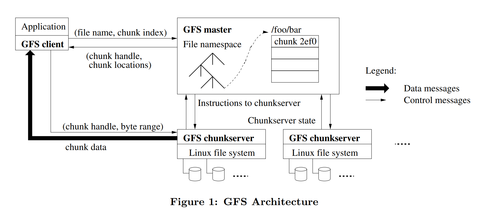
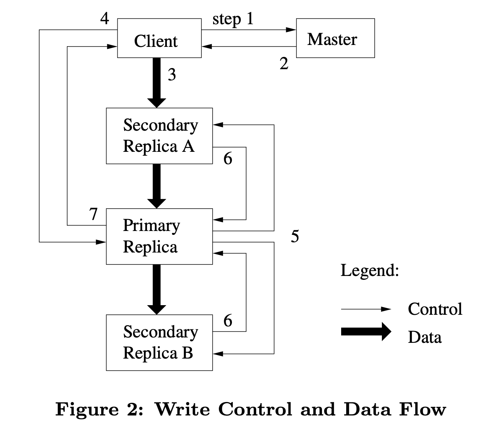

## GFS Design point

1. component failures are the norm rather than the exception so need constant monitoring, error detection, fault tolerance, and automatic recovery
2. files are huge by traditional standards
3. most files are mutated by appending new data rather than overwriting existing data. No random write within a file
4. co-designing the applications and the file system API benefits the overall system by increasing our flexibility

## Design Overview

### Architecture

1. API: create, delete, open, close, read, write, snapshot, record append
2. Files: chunk - fixed Byte Block identified by uint64, one chunk have 3 replicas on different chunkserver.
3. Master: all file metadata, include namespace, access control, chunk mapping, chunk location. Activities: chunk lease, gc, chunk migration. heart beat msg to keep chunkserver alive
4. Not POSIX API. client communicate to master for metadata and directly read write data to the chunkserver

### Single Master

hold the metadata.

when client try to perform simple read/write

1. first it use chunk size get chunk idx and offset,
2. then send filename and chunk idx to master to get the replicas handle and locales,
3. then send request to one replica with specified chunk and byte range.
4. in fact, client always ask multiple chunk in the same request to master

### Chunk Size

choose 64MB

Large chunk size advantage:

1. reduce client's need to interact with the master.
2. client more likely to perform operation on the same chunk
3. reduce metadata size

Disadvantage:

1. small file
2. chunk server will be hot spots while to much client access the same file.(add replica number)

### Metadata

3 type:

1. file and chunk namespace
2. mapping file to chunk
3. replica location

1 and 2 use **operation log** to keep persistent. for 3, master ask from chunkserver when master init or chunkserver join in.

#### In-memory Data Structure

access fast

background periodically scan, use to implement chunk gc, re-replication in failure, chunk migration to balance

maintain less than 64byte for each 64MB trunk, namespace require -64byte per file,

#### Chunk Location

On chunkserver, master init to get from them, up-to-date by regular HeartBeat msg to chunksever.

why?

Master can not keep asking chunkserver because of the high cost to sync, and some unexpected vanishment will happen on chunk, so let chunk server to communicate to master and keep alive by heatbeat.

#### Operation Log

A historical record of critical metadata changes. record metadata and use local time line to define concurrent operation order.

Files and chunks are all uniquely and eternal identified at local created time.

Replicate it to multiple remote mechine and only after flush record both remotely or locally then respond a operation.

To quickly start up, the checkpoint will be created when log beyond a certain size. The creation of checkpoint will not delay the mutations in a separate thread. a incomplete checkpoint will be skipped on recovering.

### Consistency Model

#### By GFS

File namespace mutations are atomic by namespace locking.

a file region:

1. is consistent when all client always see the same data
2. is defined after ONLY a mutation succeeds if it is consistent. (know which mutation perform)
3. is undefined but consistent when concurrent successful mutations.(all client read same but do not know which actual mutation perform)
4. is inconsistent after a failed mutation

Application only need to distinguish defined region from undefined one.

Mutation: write and record append

when client perform a record append, it will get a offset to mark the file region start offset.

The mutation will be apply to a chunk in same order to all chunk replica. After that, they use chunk version to verify the chunk whether is stale, and stale one will be gc.

For cache chunk location in client, their read window is limited by timeout and next open for this file(clean cache). reader can recognize the stale replica by too early EOF(usually append operation).

Regular handshake to check chunkserver alive and detect data corruption by checksumming

if all replica of a chunk failed before master can react then the chunk will be unavailable.

#### Implication for Application

Relaxed consistency module -> more append than overwrite, checkpointing, writing self-validating, self-identifying record.

## SYSTEM INTERATIONS

Minimize master's involvement.

### Leases and Mutable order

Primary, the master graints a chunk lease to one of the replica. This is the first replica to perform mutation, and to guide leave ones.

1. Ask master for chunk location
2. return primary and secondary
3. push data to chunk any order, replica saved in LRU
4. Send (all replica receive), primary start perform lease
5. Primary correspond write request
6. secondaries reply
7. reply to client, send error from secondaries, let client handle

File maybe consistent and undefined after concurrent client.

### Dataflow

data is pushed linearly along a carefully picked chain of chunkservers in a pipelined fashion. the "closest" machine not recieved the data.

### Atomic Record Appends

like O_APPEND in UNIX, it just happen on a offset decided by GFS.

expensive, like MPSC

extract logic: exceed the current chuck will pad to maximum size and client get the reply to indicate a new chunk need.(append size limit to 1/4 chuck max size)

replicas may NOT be bytewise identical, they just atomically append once.

if append fail, application deal with error by themselves

### Snapshot

make a copy for a file or a directory instantaneously.

use COW to implement. Receive snapshot request -> cancel all relative lease -> copy metadata -> perform mutation via copying a new C' chunk locally

## MASTER OPERATION

placement decisions, create new chunks, hence replicas, keep chunk fully replica and balance load

### Namespace

do not want slow operation delay other operation -> many op can be active by locking

namespace: mapping full path -> metadata, so a write-read lock is associated with may node in namespace tree with prefix compression.(e.g. /f1/f2/f3/leaf, /f1/f2/f3/leaf node write lock and /f1 /f1/f2 /f1/f2/f3 read lock )

read-write lock is initialized lazily and deleted once node not used. acquired order: level, lexicographical.

### Replica Placement

To maximize data reliability and availability, maximize the network bandwidth usage.

Spread replicas across racks, read can less per rack, but write must cover all racks.

### Creation, Re-replication, Rebalance

Choose where to create:

1. place new replicas on chunkservers
2. limit recent creation number on each chunkserver
3. spread replicas across racks

when re-replicate: available chunks less than user specified

1. chunkserver -> unavailable
2. replica -> corrupted
3. dish -> unavailable

factor:

1. far from replication goal
2. live file rather than recently deleted
3. boost priority of blocking client chunk

just clone form valid chunk, but limit the amount on one machine and when balance master prefer to copy to delete chunk on high usage server

### Garbage Collection

no immediately reclaim space from file or chunk but delay to regular GC .

#### Mechanism

delete -> file to be hidden name and deletion times-temp(can be read and rename to be normal) -> GC to reclaim(over 3 days)

On GC, master detect orphaned blocks and erases metadata -> heartbeat to let chunkserver know which chunk should be reclaimed

#### Discussion

##### Advantage

1. simple and reliable. To unknown valid chunk on server to delete.
2. background, can be done in batches and amortized cost.
3. safety net against accidental irreversible deletion.(cancel delete)

##### Disadvantage and Protocol

1. fine tune usage on tight storage
2. repeatedly crate and delete

quick GC when explicitly deleted again, and different policies can be applied to different namespace

### Stale Replica Detection

when a new lease was granted to a chunk, the chunk version will be increased by master. out-date chunk will be reported when server start up. higher version will be replace by newer version because of granting error happen.

out-date chunk will be reclaimed on GC. When a operation perform to a chunk that client or chunkserver will check version from master to always get up-date data.

## FAULT TOLERANCE

### High Availability

#### Fast Recovery

master and chunkserver are designed to restore states and state in seconds. shutdown only by killing main process.

#### Chunk Replication

... as above

#### Master Replication

By operation log. only operation record flush locally and remotely on all replicas then perform.

When main process failed, it can be restart. When disk or other hardware failed, outside GFS start a new master process elsewhere with operations record. Change DNS alias can change master location.

Shadow masters provide read-only access. NOT mirror so they may lag the primary. It only update operation log and state from primary.

### Data Integrity

each chunkserver maintain its own checksum. 64KB -> 32bits, keep in memory as metadata. Checksum will be checked when any access to data and reply error, then chunkserver will copy a new chunk from other and delete the error one.

performance:

1. less cross thousands chunks.
2. check align read to checksum boundary,
3. without I/O, so often be overlapped.

Append Check:

1. just update checksum of the last chunk(no check the exit)
2. compute the new checksum block
3. if error happen on last chunk then will be detected while reading.

if writing, verify the first and the last chunk.
