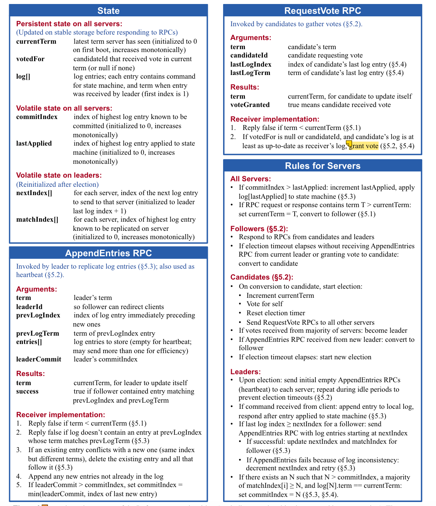
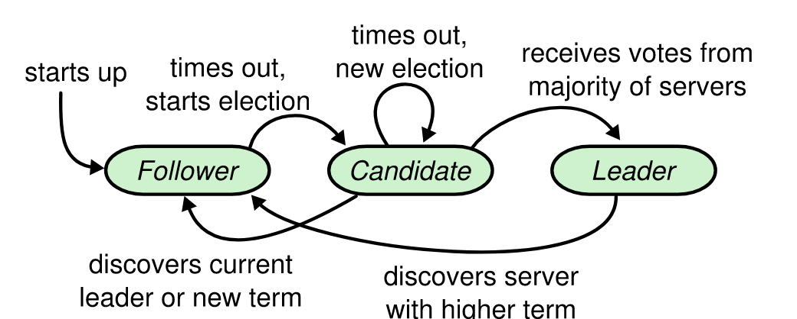

## Key

- leader election,
- log replication,
- safety,
- use overlapping majorities to change cluster membership.

## Consensus Algorithm

1. ensure safety
2. Functional as long as any major sever are operational
3. do not depend on timing
4. as soon as majority of cluster reply RPC, minority of slow sever make no impact

## Paxos

First, it defines a protocol capable of reaching agreement on **single decision**(single-decree Paxos), then combine multiple instances to facilitate a series of decisions.(multi Paxos).

### 2 Significant Drawback

1. is difficult to understand(specially on single-decree)
2. does not provide a good foundation for building practical implementations
3. peer to peer. make it more effect to do a choice

### Solve--Raft

1. problem decomposition
2. reduce number of states to consider

## Raft

1. leader selection
2. log replication
3. safety

### Restrain

### Basic

server states:

- candidate
- leader
- follower

Client only communicate to leader, and flower only reply to the request from leader.

Time -> Term(arbitrary length) as a logic timer

### Election

A follower -> candidate when no communication(election timeout)

candidates send requestVote to every server, then:

1. win win win
2. other win!!-_-
3. no winner after a period time

vote server first-come-first-serve, to which majority one become the leader and sent heartbeat, which need to be least as same as candidates else candidate keep state.

If none get the majority, then a new election will be perform by using randomized timeout to solve split vote quickly, mostly only one first wake up can get the majority while others just wait and reply requestVote RPC.

### Log Replica

Leader retry to send appendEntries to followers in parallel until all replica store entries.

Entry contains a term, a index, and operation.

Entry -> committed: when entry is copy to majority server. Follower will perform entry when learning it is committed

High level coherency.

1. same index and term -> same operation: leader only create one entry with one index in his term
2. same index and term -> same preceding entries: consistent check when each append RPC will check this then append else refuse. (indution)

When leader error, log may be inconsistent, and new leader handle this by forcing followers' logs to duplicate its own log.

When replicating to follower error, the leader will decrease the nextIndex hold in leader and retry until RPC is accepted(reach the same consistent log), it can be optimized but not necessary.

Leader will never overwrite the entries hold by itself.

### Safety

limit the server can be leader

#### Election Restriction

A candidate must hold all committed entries then can get voted. Voter refuse the candidate with less up-to-date(compare the last entry term and length).

Majority (commit, candidate) -> each leader hold committed log.

Only commit the entries with current term. The before term entries will be committed by log match.

#### Committing Entry for Previous terms

Each leader only commit the entries in his own term because previous terms was indirectly committed.

#### Safety Argument

DO NOT exit a term U leader do not hold an entry majored on term T(U > T).

1. majority hold the entry will not vote to U leader, else:
2. U leader has a larger term in last log entry, but it need a earlier leader to create, this leader must contain the entry, so U must contain the entry. Conflict.

The State Machine Property: Leader always has a completed log, so the same log entry will apply to the unique index.

### Follower and Candidate Crashes

1. Retry the same RPC.
2. Restart then will recieve the same RPC

### Timing and Availability

Leader election: boardcastTime << electionTimeout << MTBF

## Cluster Membership Change

Co -> Con -> Cn (o: old, n: new)

In Co, new server should not vote but learn the log.

In Con, leader must get the consensus from old and new. (such as log)

In Cn, new Leader will be elected.

## Log Compaction

Snapshot.

Use an index and term to store the sate of a snapshot, prevent the unlimited growth of logs, and accelerate the speed of start.

Service need to snapshot manually.

Use InstallSnapshot to send the snapshot to follower and follower refuse all old snapshot identified by lastIncludedIndex.
