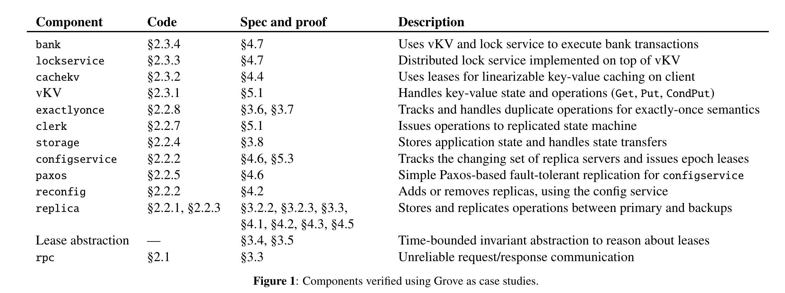
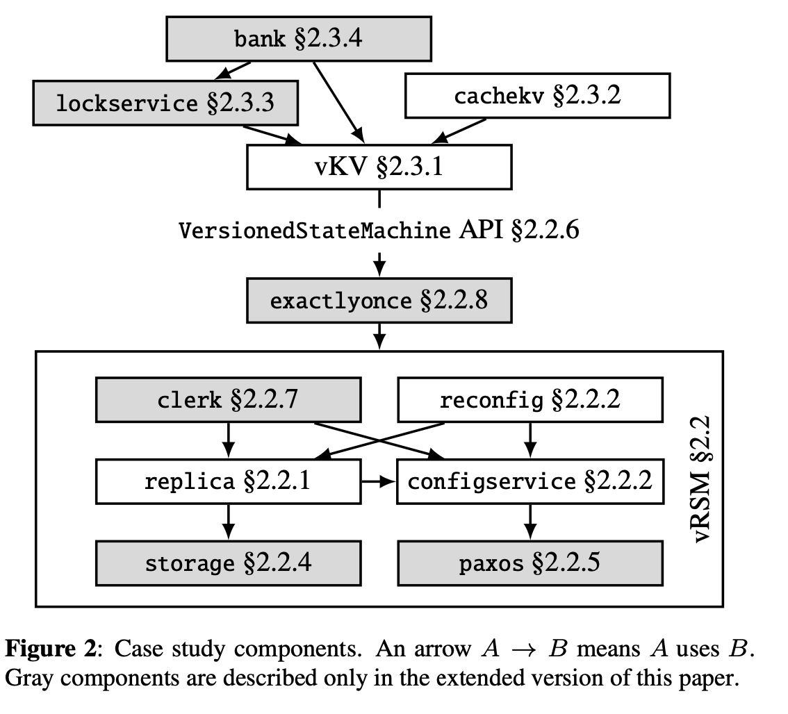
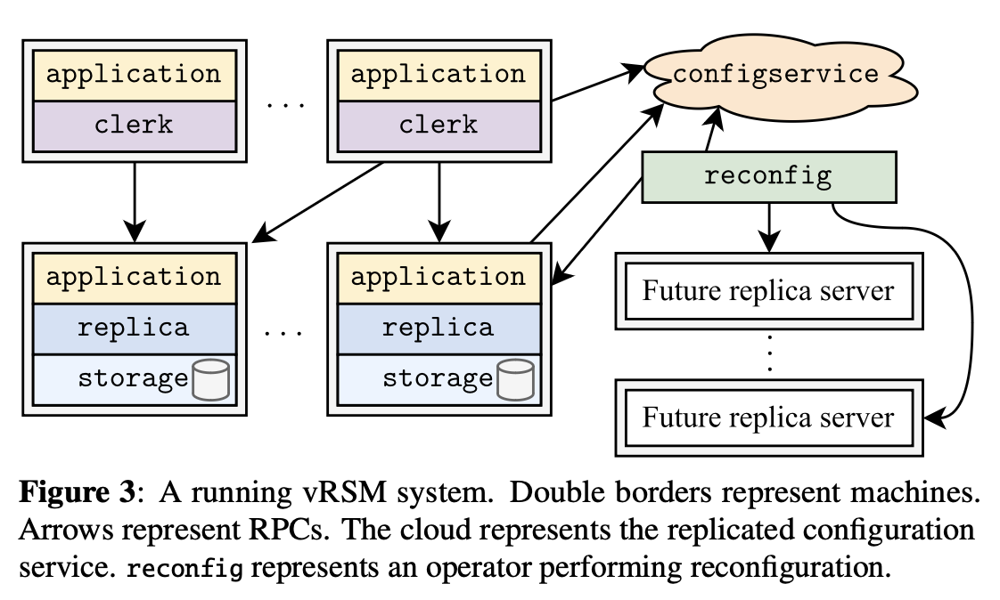

(Pay attention on section 1, 2, 7, so less attention on Grove proof but more on backup k/v service)

# Introduction

Grove is a concurrent separation logic library for verifying distributed systems.

Some piceies:

1. distributed system: resource and ownership.
2. crashing: extend Crash Hore Logic
3. leases: time-bounded invariants
4. abstraction:
	1. append-only log
	2. monotonic epoch counter
5. verified RPC library

CLS, concurent sparation logic.

Grove ensure proof of secure but cannot verify liveness properties.

# Motivating Case Studies

## RPC

Use various clerk to wrap RPC.

## Replicated State Machine Library

### Replica Server

A server is primary to handle write requests from clients.

For a write operation, the primary applied it locally then back up to all servers concurrently. After all finish that the RPC from client can be replied.

### Reconfig Using Configserver

An epoch <-> a configuration

- Epoch live: a set of server with a designed primary.
- Epoch reserve: never start running (such as reconfig crash)

When change epoch, a server from old epoch will be sealed. All new epoch server will get a stable checkpoint of the system state.

The configuration receive the highest epoch, prevent the partition of network.

### Leave-based Read

The leave is the promise of epoch, updated by a background thread which communicate to configuration.

When a server meet a only-read operation, it will wait for the write operations depended by read finished, meanwhile all committed operation hold locally. If configuration changed during waiting, reply client to retry.

Provide a time-like api to get range of timestamps.

### Storage

state logger: background thread to asynchronously appends and syncs the buffer to the file.

Wait(): wait for persisting.

### Fault-tolerant Configservice Using Paxos

as title, details are all about Paxos. PASS

### Versioned State Machine API

4 functions:

- Apply
- Read
- GetState
- SetState

Read optimization: specified the depending write operation and return quickly when no relative write operation.

### vRSM Clerk

Get server address and store it locally.

### Exactlyonce

(ClerkID, RequestID) to identify the unique operation.

## Application

### vKV

To improve performance, store a map key to index to allow vKV take advantage of versioned state machine interface.

### Lease-based Client-side Caching

- GetAndCache: Use condPut to atomically increase lease duration.
- Put: condPut to put only when lease is expired.
- Get: First on cache.

### Lock

on top of vKV, use condPut(). Provide Lock() and Release() on a specified key-value.

### Bank Transaction

- Transfer(src, dst, amt): get the src, dst lock(sorted to prevent dead lock)
- Audit(): get all lock

When crash, the lock will not be release, so need a undo operation.
